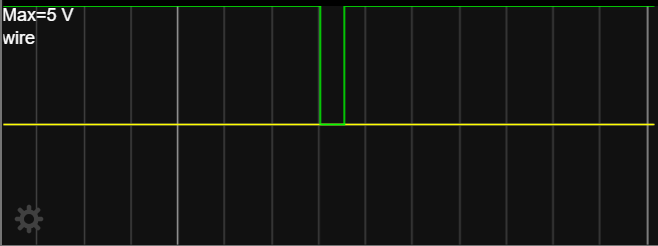
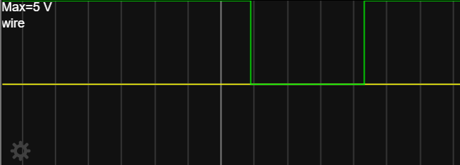
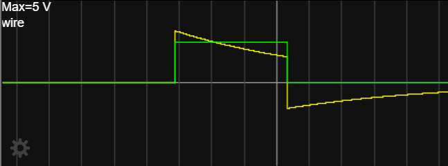

# Rapport: Monostable Multivibrator Using NAND

## 1. Objective

The objective of this work is to simulate and analyze the behavior of the electronic circuit shown in the provided schematic. The studied circuit operates as a **monostable multivibrator**, also known as a **one-shot circuit**.

A monostable multivibrator is characterized by having:

**One stable state**.

**One unstable (temporary) state**.

When triggered by an input pulse, the circuit leaves its stable state for a fixed duration and then automatically returns to the stable state.

---

## 2. Main Components

The circuit consists of the following primary elements:

- **Two logic gates:** Represented by the yellow blocks in the schematic.

- **One capacitor (C):** Used for timing.

- **One resistor (R):** Used for timing.

- **Common ground reference**.

### Voltage Observation Points

The simulation tracks four specific nodes:

- Input logic signal to the first logic gate.

- Output of the first logic gate and input to the capacitor.

- Output of the second logic gate.

- Output voltage across the RC network.

---

## 3. Circuit Operation and Simulation

The simulation was performed using **Falstad**, an online simulator that allows for real-time visualization of voltages and currents.

### Simulation Setup

- The circuit was constructed by placing logic gates, resistors, capacitors, and voltage sources according to the schematic.

  
- **Digital logic gates** generate binary signals (HIGH/LOW), while **analog components** (R and C) determine the time-dependent behavior.

- The input is driven by a pulse-generation circuit that produces a periodic digital signal without an external clock source.

### Role of the RC Network

The duration of the pulse is governed by the resistor and capacitor:

- A **larger resistance** increases the pulse duration.

 
- **Smaller values** result in faster oscillations or shorter pulses.

---

## 4. Observed Outputs

The simulation provides visual data for the behavior of each node:

---

## 5. Conclusion

The simulation confirms that the circuit behaves as a **monostable multivibrator**. Upon receiving a trigger, the output generates a pulse of a fixed duration defined by the RC network and then returns to its stable state. This observed behavior matches the theoretical operation of monostable circuits.
