# Circuit Simulation Journey: A Tale of Tools, Ethics 

**By:** Hassani Fateh & Kahlrras Raid  
**For:** Mr Sahraoui Walid & Mr BOUCHACI Islem  
**Date:** December 2025

---

## Introduction: Why We're Here

Before building any circuit in real life, we needed to simulate everything. Simulation helps us:
- Understand how the circuit behaves
- Check voltages and signals
- Find mistakes early
- Make sure the design works as expected

Simple, right? Wrong !

This report is the story of how we tried to simulate three analog/digital circuits and ended up learning more about software tools, ethics, and teamwork than we ever expected.

Spoiler: It took us through 4 different tools before we finally got it working.

---

## The Circuits We Needed to Simulate

Before we talk about the chaos, let's explain what we were actually trying to build. We had three circuits to simulate, each with its own challenges.

### Circuit 1: Switched-Capacitor / Transmission-Gate Sampling Network

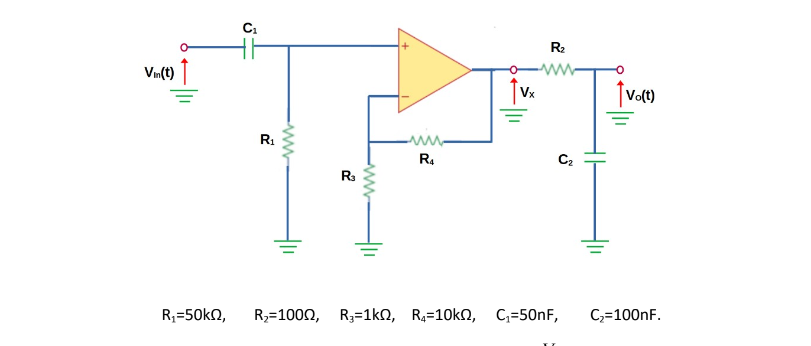

**What it is**

A tiny sample-and-hold / charge-transfer block. We connect the input to a capacitor with a transmission gate (analog switch) to sample the voltage, then we isolate the cap and connect its other plate to the output so charge moves and the output updates. There's a resistor to ground that slowly bleeds the held voltage.

**What happens during simulation (step by step)**

1. **Sample phase (φ1 closed):** Input V₁ is tied to the capacitor left plate. The cap charges to approximately V₁.
   - *Waveform:* The left-plate voltage follows V₁ while switch closed.

2. **Switching (φ1→φ2):** Left switch opens, right switch closes to transfer charge to the output bus. Charge redistributes between the sampling cap and output capacitance → output jumps to new value.
   - *Waveform:* Output node shows a step (stair) or jump when transfer happens.

3. **Hold / droop:** With output node connected to resistor R to ground, output decays exponentially: V₄(t) = V₄(0)·e^(-t/(RC_eq))
   - *Waveform:* Slow exponential decay (droop).

4. **Repeated sampling:** Next φ1 recharges the cap and repeats.

**Shapes & events to probe**

- Probe input V₁: whatever test signal we apply (DC step, sine, whatever)
- Probe left-plate: track charging during φ1 , a quick RC charge curve if switch has R_on
- Probe output V₄: step when transfer happens; then exponential decay until next sample
- If you zoom around the switching instant you may see tiny spikes from charge injection or clock feedthrough

**Useful formulas**

- Charge sharing final voltage: V_out = (C/(C+C_out))·V_sample
- Droop time constant: τ = R·C_eq
- Example numbers: If C = 10 nF and R = 1 MΩ, then τ = 10 ms so droop is obvious on the ms scale

**Common sim problems we expected**

- No ground → simulator errors
- Switch model missing → need proper analog switch or MOS transmission gate models
- Clock timing wrong → ensure φ1 and φ2 are non-overlapping
- Charge injection visible → expected behavior; reduce by using transmission gate (NMOS+PMOS)

---

### Circuit 2: AC-Coupled Non-Inverting Op-Amp + Output RC Filter

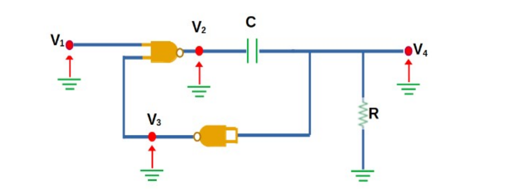

**What it is**

A non-inverting amplifier that blocks DC on the input (C1) and has a small low-pass at the output (R2 + C2). Gain is set by R3 and R4.

**Given values:**
- R1 = 50 kΩ, C1 = 50 nF → input high-pass
- R3 = 1 kΩ, R4 = 10 kΩ → gain = 1 + R4/R3 = 11
- R2 = 100 Ω, C2 = 100 nF → output low-pass

**What to expect in simulation**

**Frequency domain (AC sweep):**

- **Low frequencies:** Below f_HP ≈ 1/(2πR1C1) ≈ 64 Hz. Below this the gain falls (–20 dB/dec)
- **Midband:** Flat gain ~11
- **High frequencies:** Output RC cuts above f_LP = 1/(2πR2C2) ≈ 15.9 kHz, plus the op-amp's own GBW will further roll off

**Time domain:**

- Apply a sine sweep or a step: you'll see low frequencies strongly attenuated, midband amplified by 11, high frequencies rolled off/smoothed
- For a step input: capacitor C1 + R1 cause slow baseline restoration (time constant ~2.5 ms)
- Output will show amplified AC portion; DC offset is removed

**Waveforms to plot**

- Vin (before C1) and V+ (after C1) to see coupling effect
- Vout (op-amp output) steady state sine and step response
- For large amplitude fast waveforms, check slew limiting and distortion

**Simulator gotchas**

- Power rails matter → give the op-amp model the correct ±V rails
- Op-amp model selection → pick a realistic model with GBW and slew rate
- AC simulation → run .AC sweep from 1 Hz to 100 kHz to capture HP and LP corners
- Transient simulation → use time step small enough to resolve high-frequency content

---

### Circuit 3: Counter + DAC + Comparator (Ramp/Count ADC)

**What it is**

A simple counting ADC: we hold the analog input, then count up a binary counter that drives a DAC. The DAC output rises in steps. A comparator watches DAC vs held sample; when DAC ≥ sample, comparator stops the clock and the counter value is our digital result.

**Expected simulation behavior (timeline)**

1. **Reset and sample:** Put counter to 0, sample the input on an S/H capacitor. Comparator sees DAC(0) < sample.

2. **Enable clock:** Each clock tick increments counter → DAC steps up (staircase).
   - *Waveform:* DAC output is a staircase ramp; counter bits toggle in binary pattern.

3. **Comparator trip:** When DAC step crosses sample amplitude, comparator output flips and gate stops the clock.
   - *Waveform:* Comparator output shows a digital transition; DAC staircase stops at the crossing step.

4. **Read the counter:** That count is the measured code.

**Key numbers & practical example**

- Let DAC full scale = V_ref. For N-bit DAC, LSB = V_ref/2^N
- Example: N=8, V_ref=5V → LSB = 5/256 ≈ 19.53 mV
- If sample = 1.0 V, expected code ≈ 1.0 / 0.01953 ≈ 51 (decimal)
- Conversion time worst case = 2^N clocks (if sample ≈ full scale)

**Waveforms to probe**

- Analog sample voltage (held) : flat during conversion
- DAC analog output : staircase rising step by step
- Comparator input pins : crossing event visible
- Comparator output : digital high/low that gates the clock
- Counter outputs : binary waveform; you can display decimal too

**Simulation pitfalls we expected**

- S/H must hold during whole conversion
- DAC settling time → ensure clock period is long enough
- Comparator propagation delay and metastability
- Clock gating spikes → the gate that stops the clock must not produce extra pulses
- Timing resolution → set transient timestep small enough

---

## The Tool Journey: 

Now that you know what we were trying to simulate, here's the story of how we tried (and tried, and tried) to actually do it.

### Act 1: Proteus ~ The Obvious Choice (But Not an Option)

**Why Proteus?**

Proteus is one of the most common tools used for circuit simulation, especially in universities. It is:
- Easy to use
- Has a nice interface
- Supports both analog and digital circuits
- Perfect for our project

**The problem?**

Proteus is paid software.

Yeah, cracked versions are everywhere. We could've downloaded one in 5 minutes. But here's the thing:

**From a cybersecurity point of view:**
- Cracked software can contain malware or backdoors
- It breaks software license rules
- It goes against ethical and professional values

We're cybersecurity students. So we said no to cracked Proteus, even if it was the easiest solution. (خفنا على أجهزتنا لي هي راس مالنا)

**Decision:** Find a legal, free alternative.

---

### Act 2: LTspice ~ Free, Powerful, and… Painful

**Why LTspice?**

LTspice is a free and very powerful circuit simulator. It's used by many engineers and companies, and it's known for accurate analog simulation.

Perfect, right?

**First experience: Confusion**

At the beginning, LTspice was *hard*:
- The interface is not very friendly
- Many things depend on shortcuts
- Error messages are confusing for beginners
- You must understand how SPICE works, not just draw circuits

**Learning phase**

To understand LTspice, we followed this tutorial playlist:  
https://www.youtube.com/watch?v=16I7lkfHNGU&t=281s

We spent about one hour learning:
- How to draw circuits
- How to connect components correctly
- The importance of grounding
- How to run simulations and read results

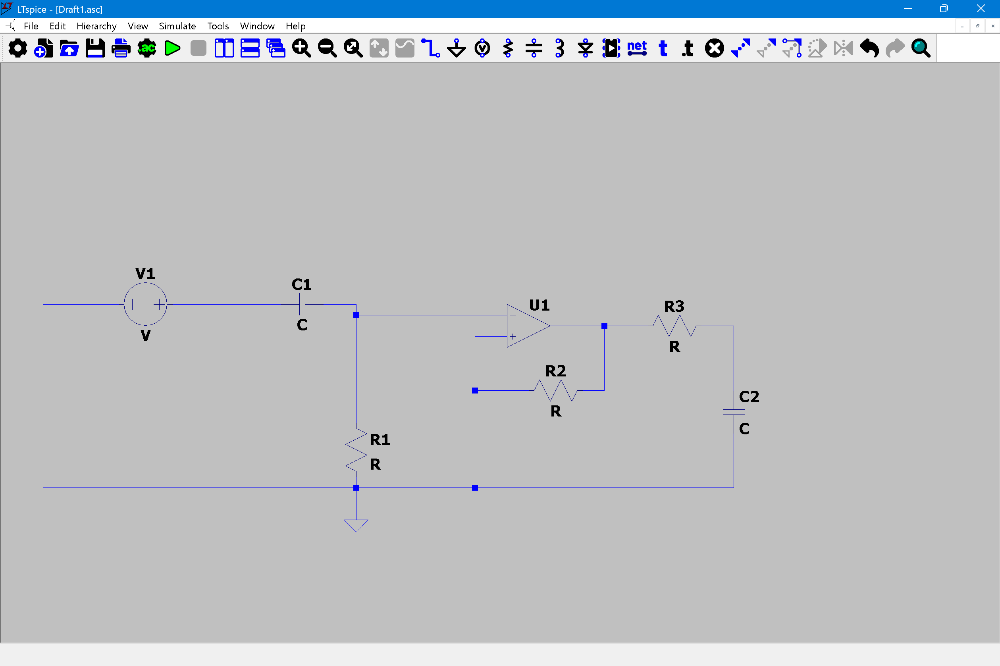

This helped us understand the basics, but it was only the beginning.

**Simulation problems: The nightmare**

When we tried to simulate our *real* circuits, we faced many errors:
- Missing ground connections
- Floating nodes
- Op-amps not powered correctly
- Switches and digital parts needing special models
- Error messages that did not clearly explain the problem

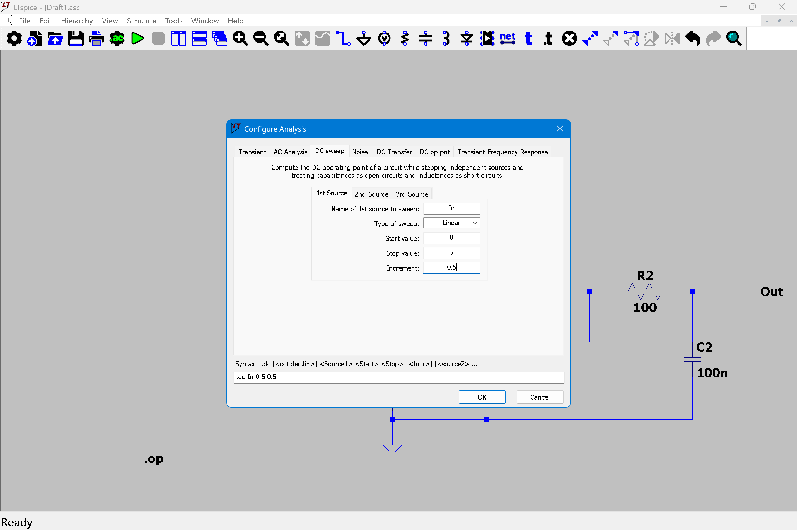

Instead of analyzing the circuit behavior, we spent most of the time debugging the simulator itself.

This made progress slow and frustrating.

**Decision:** We decided to move on to another tool.

---

### Act 3: DesignSpark PCB ~ Great Design, Terrible Simulation

**Why DesignSpark PCB?**

After LTspice, we tried DesignSpark PCB, a free tool used for schematic design and PCB creation.

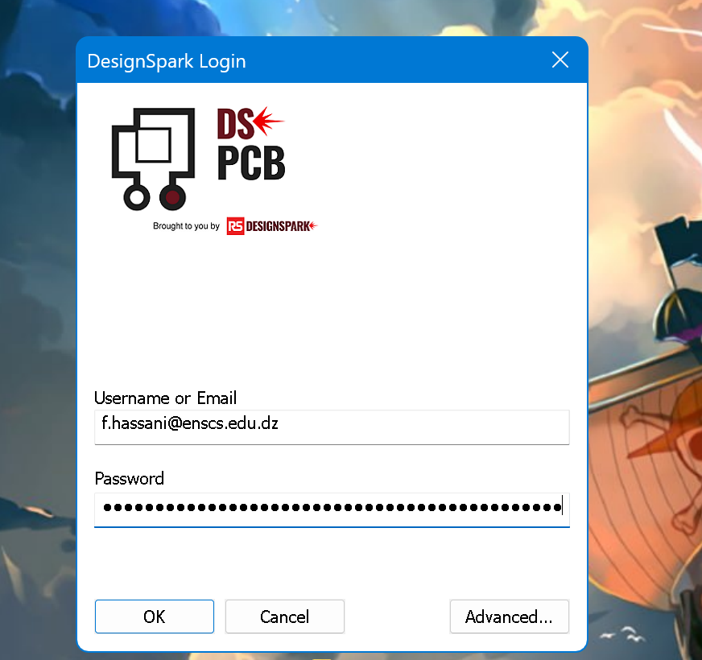

Why we chose it:
- Free and legal
- Easier to use than LTspice
- Clear schematic drawing
- More user-friendly interface
- Good for organizing and documenting circuits

**Our goal:**
- Redraw circuits clearly
- Better understand connections
- Prepare clean schematics for simulation or future work

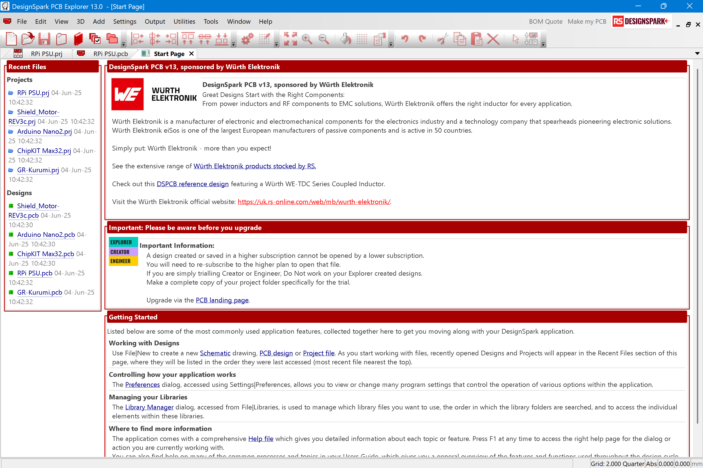
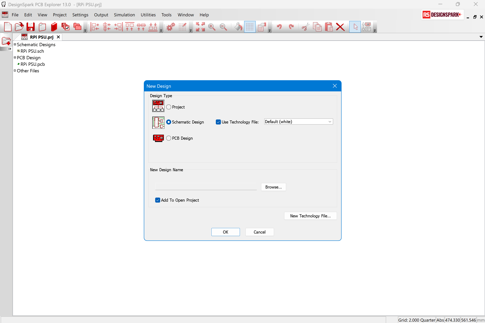

**Design experience: Great!**

DesignSpark PCB was very easy and practical to use:
- Drawing circuits was fast and clean
- The interface was simple and well organized
- Connections were clear and easy to follow
- Schematics looked professional and readable

From a design perspective, DesignSpark PCB worked very well.

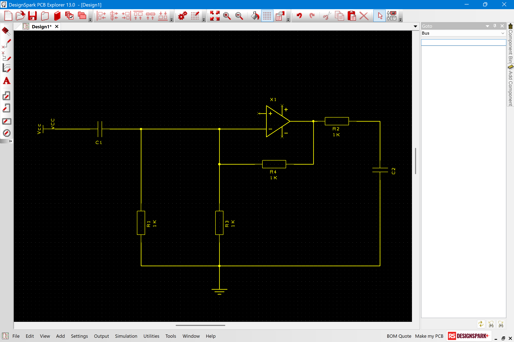

**The simulation nightmare: Not great.**

The real problem appeared when we tried to simulate the circuits.

Simulation in DesignSpark PCB is not straightforward:
- Simulation setup is complicated
- Documentation is limited
- Error messages are unclear
- Mixed analog and digital circuits are hard to simulate

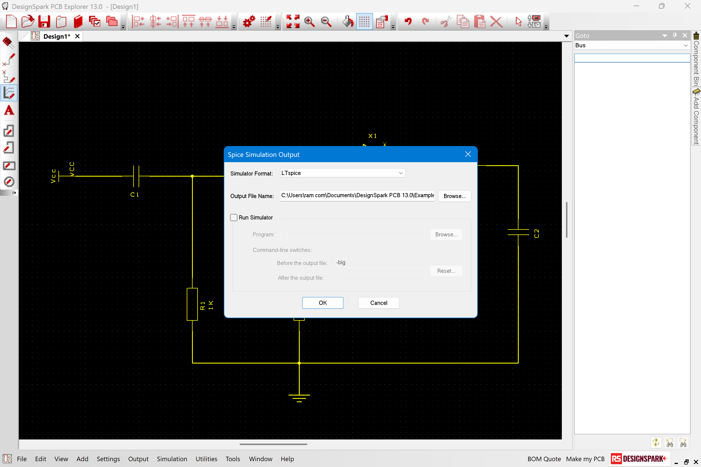

**We spent most of the night trying to make simulations work:**
- Changing settings
- Testing small examples
- Searching online for solutions
- Rebuilding circuits multiple times

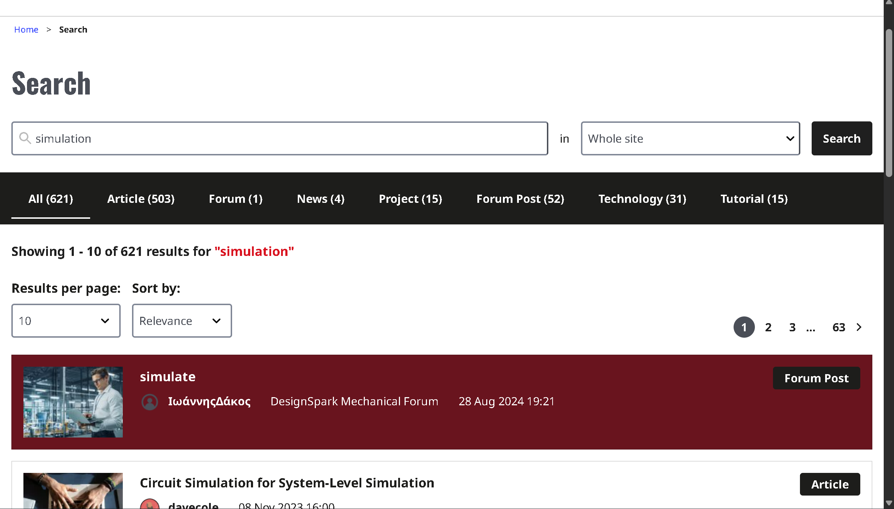

Nothing worked as expected. Instead of analyzing voltages and signals, we were stuck dealing with software issues.

At that point, we were exhausted and out of ideas.

**Decision:** We made a very human engineering decision.

We stopped and went to sleep. 💤

---

### Act 4: Morning Clarity and the Proteus Demo

**The next morning**

With fresh minds, we looked at the problem differently. Instead of searching for a "perfect" tool, we searched for a *working and ethical solution*.

That's when we found:

**Proteus Free Trial**

Proteus provides a limited free trial that is:
- Legal ✅
- Safe ✅
- No cracked software involved ✅
- Suitable for our simulation needs ✅

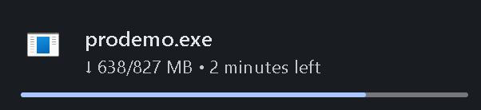

This solution allowed us to continue the project without compromising our values or wasting more time.

---

### Using Proteus Demo: Fast Success… and a New Limitation

**First impression: Finally!**

The difference was immediate.

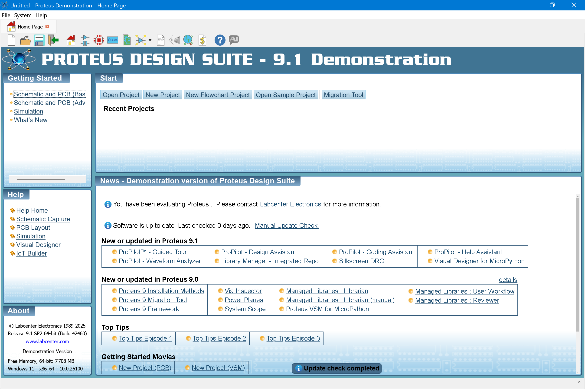

Within 15 minutes, we were able to:
- Draw the first circuit ✅
- Place all components correctly ✅
- Set component values ✅
- Run the simulation ✅
- Observe waveforms and behavior ✅

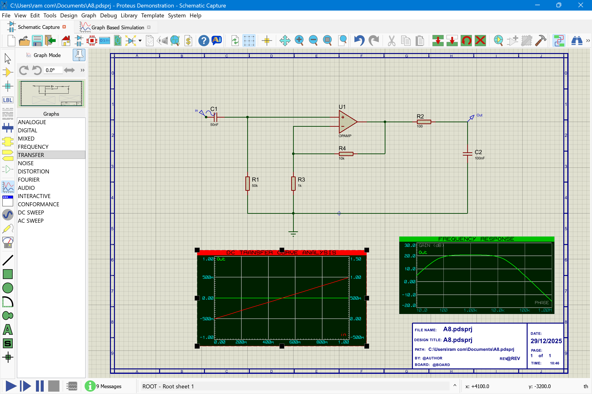

Compared to the *hours* spent struggling with other tools, Proteus felt fast, smooth, and intuitive.

For the first time, we were not fighting the software — we were actually analyzing the circuit.

**At this point, everything looked perfect.**

**The "ProDemo" reality check**

Then came the surprise.

When we tried to save our work, Proteus displayed a message from ProDemo mode:

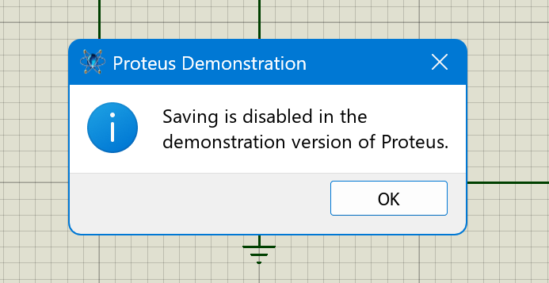

> **Saving project files is not allowed in the demo version.**

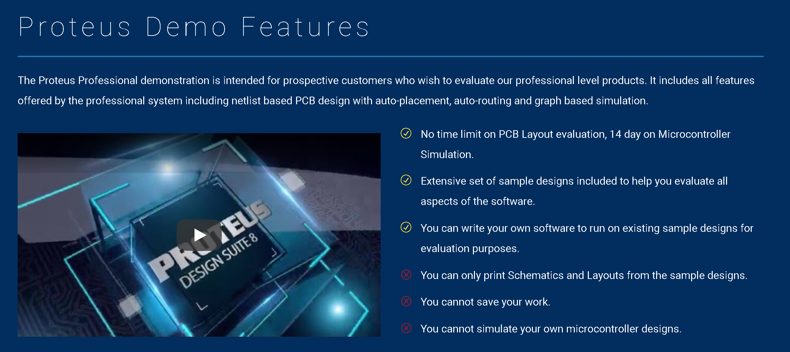

(It was in the downloading page ~ حنا لي أغبياء)

This meant:
- We could simulate the circuit 
- We could see results 
- But we could not save the design files 

In simple words: The simulation worked … but nothing could be stored.

**Impact on the project**

This limitation created a new challenge:
- Any modification requires rebuilding the circuit again
- Progress cannot be stored normally

**How we adapted**

Instead of giving up again, we adapted:
- We focused on simulating one circuit at a time
- We took screenshots of schematics and waveforms
- We carefully documented results immediately
- We minimized closing the software during work sessions

This approach allowed us to continue working within the limits of the demo version, while still collecting valid results for the report (to submit the simulation files)

---

### The Final (Final) Solution :

At this point, we were tired. Tools were fighting us. Simulators were winning. Hope was… low.

So I (Fateh) said the forbidden words:

> "Rock paper scissors… loser installs the cracked version."

For about 2 seconds, this sounded like a genius idea.

Then reality hit . Cybersecurity brain activated.

**Raid said nope!**

**Plot twist: Belkacem exists**

Then we remembered something very important.

**Belkacem already had Proteus installed on his computer.** From before. No new downloads. No sketchy cracks at 3 a.m. No malware roulette.

So the plan became very simple:
- We use Belkacem's computer ✅
- We simulate everything there ✅
- We save files normally ✅
- We finish the project ✅
- We keep our souls clean ✅

**As the legend says:**

> *Belkacem was never in danger. Belkacem is the danger.* 🔥

Instead of fighting software licenses, we went back to: circuits, signals, and logic (the good stuff).

---

## What We Learned: Hard Skills Edition

Even through the chaos, we learned real technical skills.

### 1. Circuit Simulation Basics
- How simulators work
- Why grounding is mandatory
- How missing references cause errors
- The difference between ideal theory and simulation reality

### 2. SPICE Fundamentals
- Basic understanding of nodes and netlists
- What floating nodes are and why they break everything
- Convergence errors and how to fix them
- Importance of simulation models for components

### 3. Analog Circuit Behavior
- How op-amps, capacitors, resistors, and switches behave differently in simulation vs theory
- Power rail requirements
- Slew rate and bandwidth limitations
- Charge injection and clock feedthrough effects

### 4. Mixed-Signal Simulation Concepts
- Difficulty of simulating analog and digital blocks together
- Importance of proper timing
- Clock period vs settling time
- Comparator delays and metastability

### 5. Debugging Simulation Errors
- How to identify whether a problem comes from circuit design or simulation setup
- Reading cryptic error messages
- Adding series resistances and GND references to fix convergence
- Checking power supplies and initial conditions

### 6. Tool Comparison and Selection
- Evaluating tools not only by features, but by:
  - Usability
  - Learning curve
  - Project constraints
  - Legal/ethical considerations

### 7. Reading Documentation and Technical Tutorials
- Learning new tools using documentation, videos, and online resources
- Not relying only on intuition
- Following structured learning paths

### 8. Fast Schematic Building
- Quickly recreating circuits from memory and diagrams
- Working efficiently when save functionality is unavailable

### 9. Efficient Simulation Workflow
- Running simulations and analyzing results quickly
- Documenting results in real time
- Capturing waveforms and screenshots immediately

### 10. Understanding Software Limitations
- How demo versions restrict features
- Working around limitations legally
- Judging risk like a cybersecurity professional

### 11. Teamwork and Adaptation
- Making decisions as a team
- Not doing dumb solo decisions at 3 a.m.
- Using available resources (like Belkacem's computer)
- Adapting to unexpected problems

---

## Quick Debugging Cheats for the sim :

These are practical tips we learned the hard way:

**"No convergence" or weird errors:**
- Add small series resistance (1µ–1kΩ) on floating nodes
- Add GMIN steps in SPICE settings
- Check that all nodes have a DC path to ground

**"Output oscillates":**
- Add output resistor (like R2)
- Add small compensation capacitor across feedback
- Check power rail decoupling

**"Comparator keeps toggling":**
- Add tiny hysteresis
- Slow the input ramp so DAC has time to settle
- Model comparator propagation delay

**"Counter miscounts":**
- Lengthen clock period so DAC and comparator settle before counting next tick
- Check edge-triggered vs level-triggered logic
- Add debouncing on comparator output

**"Switch doesn't work":**
- Use proper transmission gate models with complementary control signals
- Ensure clock signals have proper rise/fall times
- Check switch on-resistance and off-capacitance

**"Op-amp acts weird":**
- Check power supply rails are connected
- Use realistic op-amp model (not ideal)
- Verify input bias resistor network
- Check frequency compensation

---

## Key Lessons from This Experience

This step taught us that engineering is not only about knowing formulas:

 **Tools matter** : The right tool can save hours of work  
 **Time matters** : Learning curve must fit project deadlines  
 **Ethics matter** : Taking shortcuts can cost you more later  
 **Learning how to adapt matters** — A working solution beats a perfect one that never works  

### The struggle itself improved our technical skills

Instead of just reading theory, we:
- Debugged real simulation problems
- Learned multiple tools under pressure
- Made engineering decisions with real constraints
- Worked as a team through frustration

This is what real engineering looks like.

---

## Final Wisdom from This Adventure

This project taught us one big truth:

Engineering isn't about having the perfect tools or conditions. It's about:
- Problem-solving under constraints
- Making ethical decisions when shortcuts are tempting
- Learning from failures faster than giving up
- Working together to find creative solutions

We didn't just simulate three circuits. We learned how to be better engineers.

---

## Conclusion

We started this project thinking it would be about:
- Op-amps
- Capacitors
- DACs
- Waveforms

Instead, it became a lesson about:
- Tool selection
- Ethical engineering
- Teamwork
- Perseverance

**Did we simulate the circuits?** Yes.  
**Did we learn more than expected?** Absolutely.  
**Was Belkacem the hero we needed?** 100%.

The simulation files are attached with this report. They work. They're legal. And they taught us more than just circuit theory.

---

**Submitted by:**  
Hassani Fateh & Kahlrras Raid

**To:**  
Mr Sahraoui Walid & Mr BOUCHACI Islem

**With special thanks to:**  
Belkacem (the legend) 🔥

---
